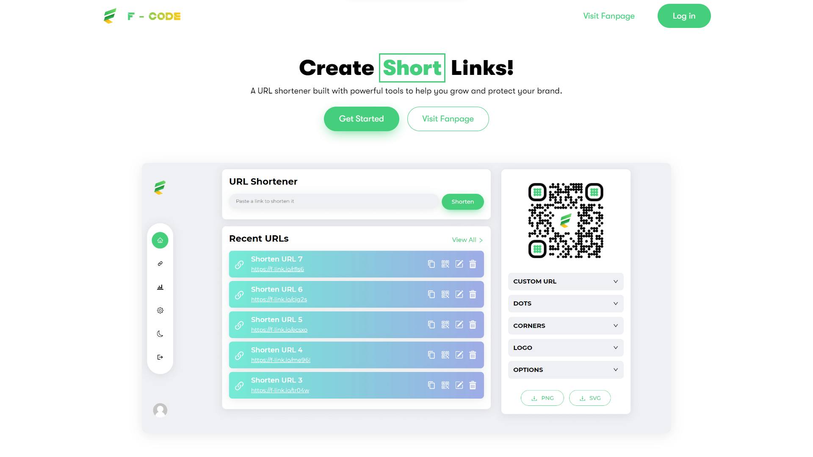
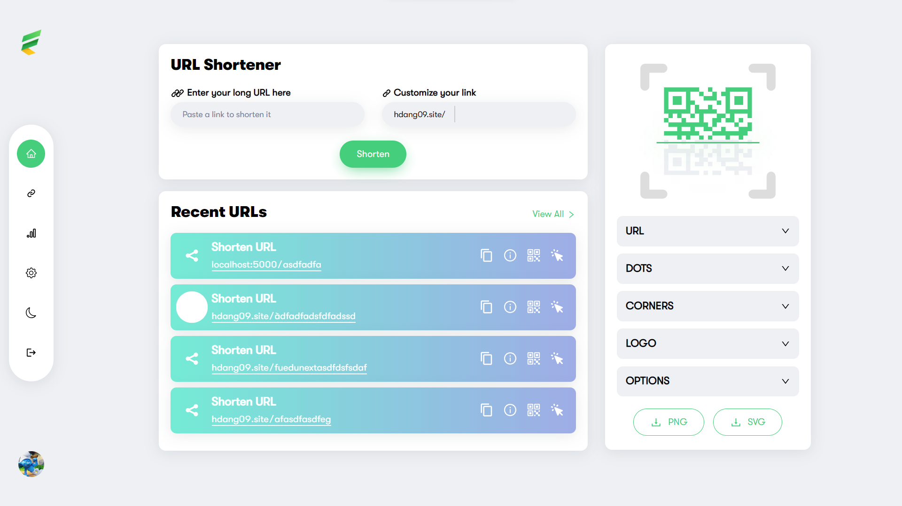
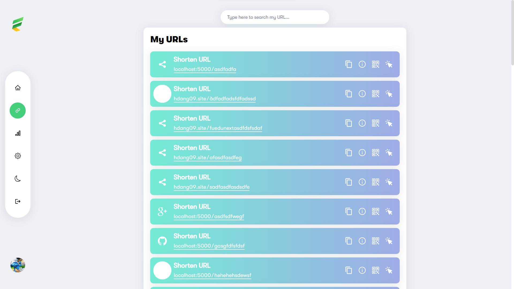
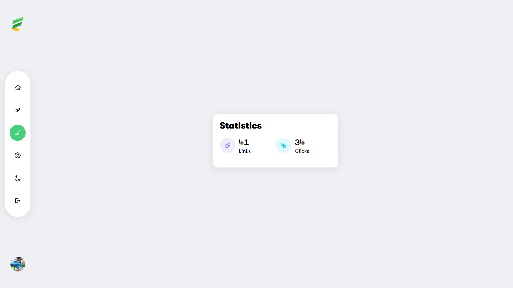
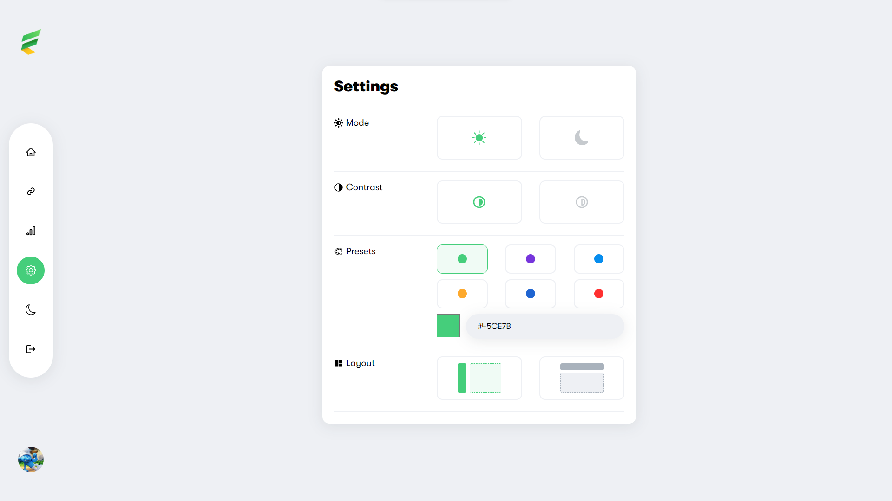
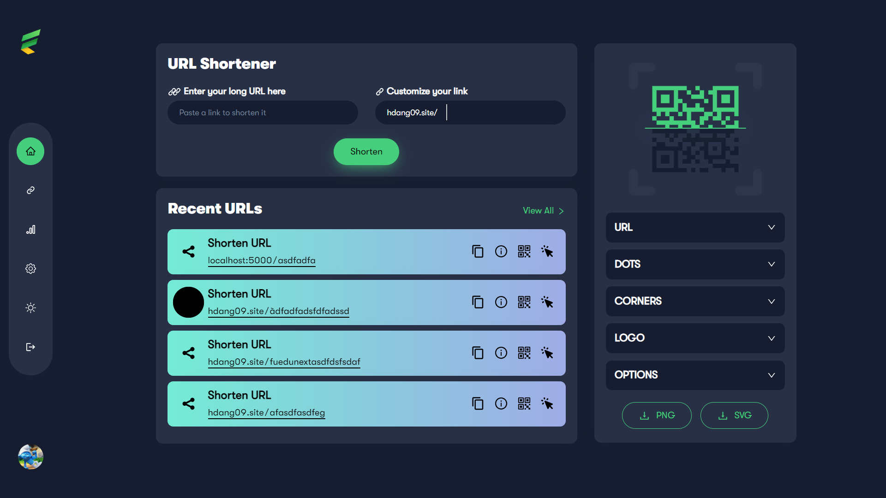

# Shorten URL Frontend

An URL Shortener that transform long, ugly links into nice, short URLs
Here is [the backend](https://github.com/khanhlinh2601/Shorten-URL-Backend)

## Team members

-   [Trần Hải Đăng](https://github.com/hdang09): Front-end, UI/UX Designer
-   [Trịnh Khánh Linh](https://github.com/khanhlinh2601): Back-end
-   [Nguyễn Trọng Nghĩa](https://github.com/nghia14302): Project Manager
-   [Nguyễn Nhật Huy](https://github.com/oHTGo): Project Owner

## Manual Installation

If you would still prefer to do the installation manually, follow these steps:

Clone the repo:

```bash
git clone https://github.com/hdang09/Shorten-URL-Frontend.git
cd Shorten-URL-Frontend
```

Install the dependencies:

```bash
yarn
```

Set the environment variables:

```bash
cp .env.example .env

# open .env and modify the environment variables
```

## Table of Contents

-   [Shorten URL Frontend](#shorten-url-frontend)
    -   [Team members](#team-members)
    -   [Manual Installation](#manual-installation)
    -   [Table of Contents](#table-of-contents)
    -   [Screenshots](#screenshots)
    -   [Technologies Used](#technologies-used)
    -   [Environment Variables](#environment-variables)
    -   [Project Structure](#project-structure)
    -   [Linting](#linting)
    -   [Contributing](#contributing)
    -   [License](#license)
    -   [Contact](#contact)

## Screenshots

Landing page

Home page

My URL page

Statistics page

Settings page

Dark mode


## Technologies Used

-   **QR Code Generator**: with [QR Code Styling](https://qr-code-styling.com)
-   **Dependency management**: with [Yarn](https://yarnpkg.com)
-   **Linting**: with [ESLint](https://eslint.org) and [Prettier](https://prettier.io)
-   **Theme**: using [Ant Design](https://ant.design/) and [Chakra UI](https://chakra-ui.com/)
-   **Skelton**: using [react-loading-skeleton](https://www.npmjs.com/package/react-loading-skeleton)
-   **Styling**: with [Styled Components](https://styled-components.com/)
-   **Tooltip**: using [TippyJS](https://atomiks.github.io/tippyjs/)

## Environment Variables

The environment variables can be found and modified in the `.env` file. They come with these default values:

```bash
# Your API Base URL
VITE_API_URL=[API_URL]
```

## Project Structure

```
src\
 |--app\            # Redux
 |--assets\         # Assets releted to the project
 |--components\     # Reused components
 |--config\         # Environment variables and configuration related things
 |--hooks\          # Custom hooks
 |--layouts\        # My layout
 |--pages\          # Routes to each page
 |--routes\         # Routes
 |--utils\          # Utility classes and functions
 |--app.jsx
 |--main.jsx
```

## Linting

Linting is done using [ESLint](https://eslint.org/) and [Prettier](https://prettier.io).

<!-- In this app, ESLint is configured to follow the [Airbnb JavaScript style guide](https://github.com/airbnb/javascript/tree/master/packages/eslint-config-airbnb-base) with some modifications. It also extends [eslint-config-prettier](https://github.com/prettier/eslint-config-prettier) to turn off all rules that are unnecessary or might conflict with Prettier. -->

To modify the ESLint configuration, update the `.eslintrc.json` file. To modify the Prettier configuration, update the `.prettierrc.json` file.

To prevent a certain file or directory from being linted, add it to `.eslintignore` and `.prettierignore`.

To maintain a consistent coding style across different IDEs, the project contains `.editorconfig`

## Contributing

Contributions are more than welcome! Please check out the [contributing guide](CONTRIBUTING.md).

<!-- ## Inspirations

-   [danielfsousa/express-rest-es2017-boilerplate](https://github.com/danielfsousa/express-rest-es2017-boilerplate)
-   [madhums/node-express-mongoose](https://github.com/madhums/node-express-mongoose)
-   [kunalkapadia/express-mongoose-es6-rest-api](https://github.com/kunalkapadia/express-mongoose-es6-rest-api)

## Improvements

## Features that can be added

## Acknowledgement -->

## License

[MIT](LICENSE)

## Contact

<p><span style="margin-right: 30px;"></span><a href="https://www.linkedin.com/in/dang-tran-hai-761024238/"></a><span style="margin-right: 30px;"></span><a href="https://github.com/hdang09"></a><span style="margin-right: 30px;"></span><a href="fdsfadfa"></a></p>

https://www.freecodecamp.org/news/how-to-write-a-good-readme-file/
